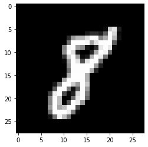
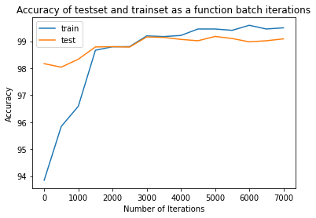

# About
The attached notebook contains a simple neural network based classifier for handwritten digits. the training and testing of the network is done using the [MNIST](http://yann.lecun.com/exdb/mnist/) data set.
An example of an image from the dataset:

The neural network is implemented using the Keras framework of TensorFlow
after ~7000 iterations on batches of 32 images, the classifier reaches an accuracy of 99% on the test set. the accuracy of both the train set and the test set is shown in the image below:

