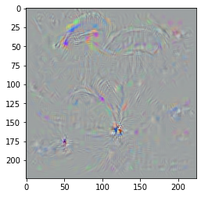

# About 
The attached notebook contains a pretrained AlexNet that performs the class
model visualization, as explained in the [Simonyan et al.
2014](https://arxiv.org/abs/1312.6034) paper.
In short, I take a network that was already trained on a classification task
on ImageNet. Then, by using an appropriate loss function and applying
the gradients on the input image(instead of the network's parameter's) I can
visualize a neuron's activation, and show inputs that result in high activation
for that neuron.

An example for such a visualization can be shown below, where I took a image of
random noise and by performing the above on a neuron that classifies the
'parachute' class, I get the following result:

