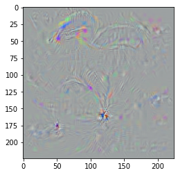

# ComputerVision

This repository contains implementations of some basic computer vision tasks using mostly neural networks but also some classic computer vision algorithms.

One example is the visualization of neural networks neurons. without jumping
into the details, I was able to take a random noise image and activate a neuron
that is in charge of classifying a parachute, which resulted in the following image:

